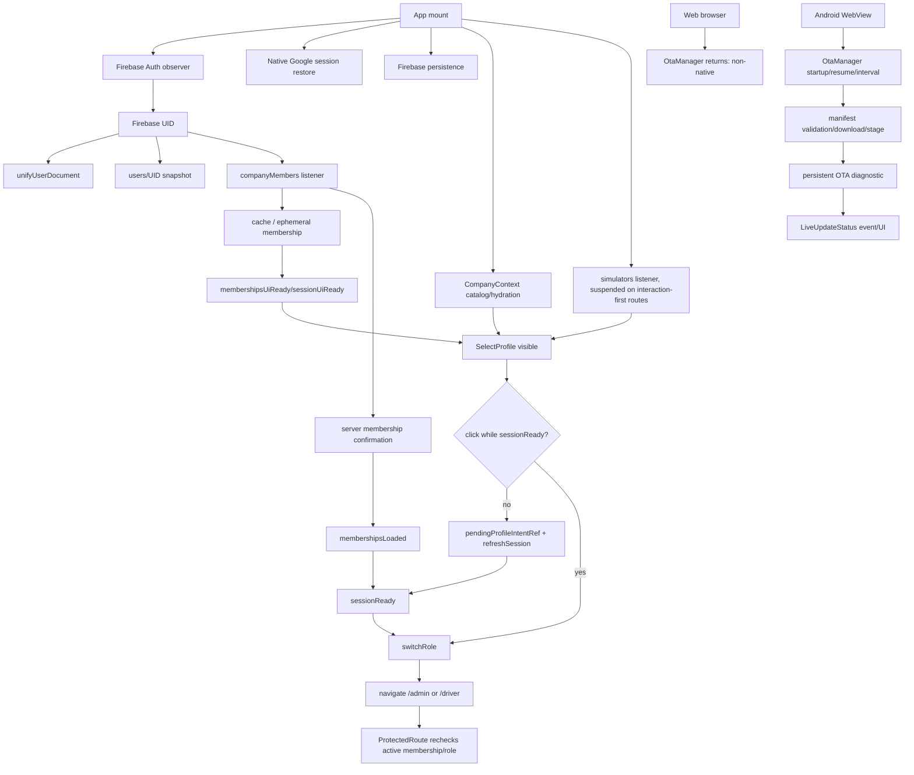

# Auditoria arquitetural de simplificação radical — NVU Web

**Projeto:** `nvu-web24-local-ota`  
**Data:** 2026-09-06  
**Escopo:** autenticação Google, restauração de sessão, memberships, empresas, simuladores, roles, navegação, perfil e OTA.  
**Status:** auditoria e plano; **nenhuma implementação foi realizada nesta etapa**, conforme a regra explícita do prompt anexado.

> **Regra aplicada:** antes de adicionar mecanismos, identificar o que pode ser eliminado, unificado, derivado ou movido para background.

## 1. Índice de complexidade atual

A contagem estática do diretório `src` encontrou **167 arquivos** e aproximadamente **64.395 linhas TypeScript/TSX**.

| Elemento | Contagem | Leitura arquitetural |
| --- | ---: | --- |
| `useState` | 217 | Estado local elevado; parte é legítima de telas, mas o caminho crítico mistura estado de UI e sessão. |
| `useEffect` | 172 | Muitos efeitos; é necessário separar efeitos de dados secundários de efeitos que alteram sessão/rota. |
| `useLayoutEffect` | 13 | Sensíveis a ordem de primeiro paint, overlays e redirecionamentos. |
| `useMemo` | 218 | Grande quantidade de estado derivado e reconstruções; aumenta o custo de rastreamento. |
| `useCallback` | 53 | Callbacks atravessam vários contextos e aumentam acoplamento. |
| `onSnapshot` | 42 | Muitos listeners; 10 estão no `AppContext`, 6 no `CompanyContext` e os restantes em dados de tela/recursos. |
| `onAuthStateChanged` | 1 | Uma autoridade Firebase foi localizada; não há prova de dois observers principais. |
| chamadas `navigate()` | 133 | Navegação distribuída por páginas e layouts. |
| elementos `<Navigate>` | 8 | Guards declarativos coexistem com effects que navegam. |
| chamadas `refreshSession()` | 7 | Refresh ainda participa do caminho de seleção. |
| `setTimeout` | 67 | Recovery, timeout, preload e UI estão distribuídos. |
| `setInterval` | 4 | Lifecycle/OTA e outros ciclos precisam de fronteiras claras. |
| `addEventListener` | 31 | Lifecycle, auth auxiliar, UI e dados usam o mesmo mecanismo. |

### Hotspots

| Arquivo | Linhas | Complexidade concentrada |
| --- | ---: | --- |
| `src/context/AppContext.tsx` | 5.954 | Auth, identidade, memberships, sessão, simuladores, listeners, recovery e ações. |
| `src/App.tsx` | 1.017 | Providers, routes, guards, resume, preload, overlays e redirects. |
| `src/context/CompanyContext.tsx` | 925 | Catálogo de empresas, hydration e listeners. |
| `src/pages/SelectProfile.tsx` | 906 | Cache visual, hydration, gate, pending intent e navegação. |
| `src/lib/resolveSimulator.ts` | 374 | Aliases, grupos, canonicalização e fallback de identidade. |
| `src/lib/simulatorOptions.ts` | 328 | Opções derivadas de catálogo e aliases de companies. |
| `src/lib/otaManager.ts` | 428 | Lifecycle, manifest, validação, download, staging, persistência e eventos. |

### Providers e contextos

Foram localizados `AppContext`, `CompanyContext`, `NotificationsContext`, `PerformanceContext`, `AuthSessionProvider`, `MembershipProvider`, `OperationalDataProvider` e `ProfileSessionProvider`. Os quatro providers em `src/contexts` projetam fatias de contextos existentes. Isso é candidato a unificação, mas não deve ser removido antes de mapear consumidores e preservar a autoridade de autorização.

## 2. Mapa do fluxo atual



### Bloqueios, waits e races

| Local | Tipo | Efeito observado ou risco |
| --- | --- | --- |
| `Login.tsx` após `auth.authStateReady()` | A navegação ocorre antes de memberships e empresa estarem canônicas. | O seletor aparece antes de a ação de perfil estar operacional. |
| `SelectProfile.handleSelect` | Clique vira `pendingProfileIntentRef` quando `sessionReady=false`. | Primeiro toque parece travado; o texto de estado é `sr-only`. |
| `AppContext` memberships | Snapshot vazio pode aguardar reconciliação; recovery usa timer de 12 s. | Cache pinta a UI, mas autorização continua pendente. |
| `AppRouteContent` | Effect decide rota com `activeRole` e `resume` enquanto outros estados chegam. | Pode haver rota visual, redirect de guard e retorno ao seletor. |
| `ProtectedRoute` | Revalida `sessionUiReady`, active company, role e membership. | É uma barreira correta, mas duplicada em relação ao pending intent e ao fluxo de seleção. |
| `CompanyContext`/hydration | Empresa pode estar ausente enquanto membership já existe. | Perfil fica visualmente disponível, mas dados operacionais não estão coerentes. |
| `resolveSimulatorId` | Fallback normaliza qualquer string desconhecida. | Simulador órfão se torna identidade válida. |
| `DriverProfileIsolated` | Fallback textual para `G. Truck` quando empresa não resolve. | Identidade inventada/enganosa é exibida. |
| `OtaManager` Web | Retorno imediato em runtime não nativo. | Nenhum banner OTA no navegador Web, por desenho. |
| `OtaManager` Android | Estados `failed` e `idle` são persistidos, mas o banner não renderiza essas fases. | Falhas podem ficar silenciosas; o aparelho exige diagnóstico. |

## 3. Classificação de complexidade

A classificação abaixo é para o caminho crítico. Dados secundários e componentes de negócio não devem ser removidos por inferência; devem ser tratados em uma etapa posterior, com testes próprios.

| Elemento atual | Classificação | Decisão proposta para o plano | Motivo |
| --- | --- | --- | --- |
| `sessionReady`, `sessionUiReady`, `membershipsLoaded`, `membershipsUiReady` | **UNIFICAR** | Derivar um único `OperationalContext.status` com valores explícitos. | Hoje a UI pode estar pronta sem a ação estar pronta. |
| `pendingProfileIntentRef` | **ELIMINAR** após contexto resolver | O botão só deve ser interativo quando o perfil estiver válido; não guardar clique silencioso. | Remove ação diferida e o primeiro toque “perdido”. |
| `refreshSession()` acionado no clique do perfil | **MOVER PARA BACKGROUND / SIMPLIFICAR** | Recovery não deve ser iniciado pelo botão; pode ocorrer antes, em paralelo, com estado visível. | O clique não deve iniciar processo crítico. |
| `identityReconciliationStatus` | **SIMPLIFICAR** | Manter apenas se produzir diagnóstico real; não deve bloquear perfil já autorizado. | Reconciliação de documento não é igual a autorização de membership. |
| `activeRole` + `activeCompanyId` espalhados | **UNIFICAR** | Serem campos do contexto operacional canônico. | Reduz inconsistência entre layout, guard e selector. |
| `AppRouteContent` redirect effect | **UNIFICAR** | Mover decisão a um `NavigationResolver` único. | Evita route → effect → redirect → context → redirect. |
| `ProtectedRoute` | **MANTER, simplificar** | Continuar como fronteira de segurança; consumir contexto canônico. | Não pode ser removido sem substituir a autorização. |
| `CompanyContext` projetando membership/catalog | **UNIFICAR parcialmente** | Separar catálogo secundário do contexto mínimo de navegação. | Empresa visível e membership autorizada não devem depender do mesmo carregamento. |
| listener de `simulators` em `/select-profile` | **MOVER PARA BACKGROUND** | Catálogo só precisa bloquear se o perfil depender dele; seleção deve usar IDs canônicos já validados. | Listener não deve controlar entrada. |
| `resolveSimulatorId` fallback para valor desconhecido | **ELIMINAR** | Retornar inválido quando não houver correspondência canônica. | Evita identidade inventada. |
| fallback `G. Truck` em `DriverProfileIsolated` | **ELIMINAR** | Exibir “simulador não vinculado” e bloquear ações dependentes. | Default textual não é dado de domínio. |
| aliases legados de simulador | **SIMPLIFICAR / MANTER temporariamente** | Usar apenas durante migração explícita para catálogo canônico. | Compatibilidade não pode criar opção nova. |
| ranking, histórico, gráficos, imagens e warmups | **MOVER PARA BACKGROUND** | Abrir experiência com contexto mínimo e aquecer dados depois. | O prompt exige eager context/lazy data. |
| `InitialBootOverlay` | **SIMPLIFICAR** | Não capturar ponteiros e não depender de dados secundários. | Overlay não deve bloquear selector. |
| `LiveUpdateStatus` dependente de evento | **UNIFICAR** | Ler persistent OTA state e usar evento apenas como otimização. | Evento pode ser perdido entre mount e effect. |
| `OtaManager` nativo-only | **MANTER** | Documentar que Web normal não exibe OTA nativa; Android usa store persistente. | A separação Web/Android é correta para Live Update. |
| fase `failed`/`idle` invisível no banner | **SIMPLIFICAR / OBSERVABILIDADE** | Expor diagnóstico de forma não bloqueante, sem transformar erro em spinner. | Falha precisa ser identificável. |

## 4. Causas raiz

### Comprovadas

**Bloqueio no primeiro clique.** O Login navega ao seletor assim que Firebase confirma a UID, mas `SelectProfile` só navega quando `sessionReady` é verdadeiro. Com `sessionReady=false`, o clique é salvo em `pendingProfileIntentRef` e o componente inicia `refreshSession()`. O usuário não recebe feedback visual normal. Referências: [`Login.tsx`](../src/pages/Login.tsx#L25-L39), [`SelectProfile.tsx`](../src/pages/SelectProfile.tsx#L440-L495) e [`AppContext.tsx`](../src/context/AppContext.tsx#L2163-L2476).

**Simulador não registrado aceito como válido.** `resolveSimulatorId()` retorna uma string normalizada mesmo quando não existe grupo no catálogo; `buildSimulatorSelectorOptions()` cria opção a partir de aliases de company; e `DriverProfileIsolated` usa `G. Truck` como fallback visual quando a empresa não foi resolvida. O reproducer executado durante a auditoria confirmou que `simulador-nao-registrado` vira ID/opção válida com catálogo contendo apenas GTO. Referências: [`resolveSimulator.ts`](../src/lib/resolveSimulator.ts#L273-L324), [`simulatorOptions.ts`](../src/lib/simulatorOptions.ts#L151-L264) e [`DriverProfileIsolated.tsx`](../src/pages/admin/DriverProfileIsolated.tsx#L190-L195) / [`DriverProfileIsolated.tsx`](../src/pages/admin/DriverProfileIsolated.tsx#L389-L395).

**Ausência de mensagem OTA na Web.** `OtaManager.start()` e `check()` retornam imediatamente quando `Capacitor.isNativePlatform()` é falso. A Web normal não executa Live Update nativo; sua publicação é imediata e não tem bundle staging local. Referência: [`otaManager.ts`](../src/lib/otaManager.ts#L161-L218).

**Estado OTA pode ser perdido ou ficar silencioso na UI.** O manager persiste diagnóstico, mas a UI depende de publicação/evento para refletir fases visuais; `idle` e `failed` não são estados de banner normal. O bundle HF208 contém o código visual, então a ausência Android não é falta de texto/componente. Referências: [`otaManager.ts`](../src/lib/otaManager.ts#L221-L307), [`otaManager.ts`](../src/lib/otaManager.ts#L394-L420) e [`LiveUpdateStatus.tsx`](../src/components/common/LiveUpdateStatus.tsx#L1-L97).

### Altamente prováveis

A repetição de logs de restauração pode ser reexecução de gerações do effect de sessão após resume/refresh, não necessariamente dois observers Firebase. Existe uma única chamada de `onAuthStateChanged`, mas a reconciliação inicia documento de usuário, memberships e recovery em paralelo. Isso precisa de telemetria por `sessionGeneration` para medir, não de mais retries.

O redirecionamento em `AppRouteContent`, o guard `ProtectedRoute` e o handler de `SelectProfile` provavelmente participam de uma sequência de decisões concorrentes. A existência de 133 chamadas `navigate()` não significa que todas são críticas, mas confirma que a navegação não está centralizada.

### Ainda necessita evidência

No Android, ainda não foi possível comprovar se a OTA falha por `manifest`, `channel`, `runtime`, assinatura, checksum, download, plugin nativo, bundle já staged/current ou apenas evento visual perdido. É necessário o diagnóstico persistido do HF208 com `phase`, `errorCode`, `currentBundle`, `nextBundle`, `manifestBundleId` e `lastCheckAt`.

Também falta identificar o registro Firestore específico que fornece o `simulatorId/simulatorName` órfão. A aceitação arquitetural está comprovada; a origem de dados exata precisa de leitura autenticada ou log seguro do contexto do usuário.

## 5. Arquitetura mínima proposta

A menor arquitetura compatível com segurança e desempenho deve conter somente as seguintes fronteiras:

```text
Firebase Auth observer
        ↓
Context Resolver
  - UID atual
  - memberships ativas canônicas
  - perfis válidos
  - empresa/simulador canônicos
        ↓
OperationalContext Store
  - status: loading | ready | no-access | error
  - profiles[]
  - activeProfile
  - activeCompany
  - activeSimulator
        ↓
Navigation Resolver
  - 0 perfis: no-access
  - 1 perfil: destino padrão
  - 2+ perfis: selector
        ↓
Experiência
  - dados secundários lazy
```

Para OTA:

```text
OTA Engine nativo
        ↓
Persistent OTA Store
  - status
  - lastCheckAt
  - currentBundle
  - nextBundle
  - updateAvailable
  - lastError
        ↓
UI não bloqueante
```

O cache pode acelerar a pintura, mas nunca autoriza por si só. A regra mínima é: UID atual deve coincidir, membership deve ser `active`, role deve pertencer à membership e empresa/simulador devem ser canônicos quando exigidos pela experiência. Se o cache não passar essas condições, ele é apenas placeholder e não torna o botão operacional.

## 6. Antes versus depois

| Antes | Depois proposto |
| --- | --- |
| Login confirma Firebase e navega antes do contexto operacional. | Login confirma Firebase; `Context Resolver` prepara o mínimo necessário antes de liberar a ação. |
| Selector pode ficar visualmente pronto e operacionalmente pendente. | Selector só fica interativo quando os perfis já são válidos; caso contrário exibe estado explícito. |
| Primeiro clique é guardado em `pendingProfileIntentRef`. | Não há clique pendente; ação disponível significa ação executável. |
| `sessionReady`, `sessionUiReady`, `membershipsLoaded` e `membershipsUiReady` participam em decisões distintas. | Um status derivado do `OperationalContext` representa prontidão e erro. |
| AppRouteContent, ProtectedRoute, layouts e páginas navegam. | NavigationResolver toma a decisão inicial; guards apenas recusam acesso inválido. |
| Empresas/aliases podem criar identidade de simulador. | Só catálogo canônico valida simulador; ausência vira estado inválido explícito. |
| Histórico, ranking, imagens e listeners podem iniciar perto do primeiro acesso. | Dados secundários começam após a experiência mínima abrir. |
| OTA UI depende parcialmente de eventos. | UI consulta persistent OTA Store; evento apenas acelera atualização. |
| Web e Android podem ser interpretados como se tivessem o mesmo OTA. | Web normal tem publicação imediata; Android tem Live Update nativo e diagnóstico separado. |

## 7. Plano de refatoração incremental e seguro

O prompt exige planejamento antes da implementação. Cada etapa abaixo precisa passar seus critérios antes da próxima.

| Etapa | Arquivos principais | Objetivo | Risco | Testes | Aprovação |
| --- | --- | --- | --- | --- | --- |
| 0. Instrumentação | `AppContext`, `SelectProfile`, `App`, `otaManager`, `liveUpdateStatus` | Registrar `sessionGeneration`, status, causa de bloqueio, current/next bundle e tempos, sem segredos. | Baixo; risco de log excessivo. | Gate de formato/redação; nenhuma regra de negócio alterada. | Diagnóstico reproduzível em Web e Android. |
| 1. Contrato canônico | Novo teste primeiro; `profileSessionGate`, `resolveSimulator`, `simulatorOptions` | Definir `OperationalContext` e rejeitar simulador sem catálogo; remover fallback `G. Truck`. | Médio; registros legados podem ficar inválidos. | Fixtures de zero/um/múltiplos perfis, cache UID diferente, simulador órfão e catálogo ausente. | Nenhum simulador desconhecido vira opção; memberships ativas permanecem. |
| 2. Navegação | `App.tsx`, `SelectProfile.tsx`, `ProtectedRoute` e `AppContext` | Centralizar a decisão inicial e eliminar `pendingProfileIntentRef`. | Alto; risco de regressão de deep link e login. | Matriz cold/warm/resume, primeiro clique, múltiplos toques, troca de perfil e logout/login. | O botão só aparece operacional quando executável; uma decisão de rota. |
| 3. Providers | `AppContext`, `CompanyContext`, providers em `src/contexts` | Unificar projeções redundantes sem quebrar consumidores. | Alto; grande superfície de dependências. | TypeScript, testes de contexto, rotas protegidas e Firestore rules unchanged. | Redução mensurável de flags/providers/listeners críticos. |
| 4. Lazy data | `App.tsx`, páginas de ranking/histórico/perfil e hooks de dados | Mover dados secundários para background. | Médio; risco de página incompleta. | First paint, skeletons locais, rede lenta/offline e dados atualizados. | Contexto e navegação não aguardam ranking/histórico. |
| 5. OTA observável | `otaManager`, `liveUpdateStatus`, `LiveUpdateStatus` e gates | UI consultar persistent state; separar Web normal de Android OTA. | Médio; risco de esconder falhas ou sinalizar falso positivo. | no-update, available, manifest/download/stage failure, current/next e cold start Android real. | Diagnóstico completo; nenhum reload durante viagem. |
| 6. Remoção | somente após gates | Remover compatibilidade, intents e flags comprovadamente não usados. | Alto se antecipada. | Busca de consumidores, lint, build, gates e regressão. | Cada remoção documenta o que quebraria se fosse retirada. |

## 8. Plano OTA separado

A primeira etapa é provar a causa no dispositivo real, sem publicar novo APK. O HF208 deve fornecer diagnóstico com fase e erro; a Web normal não deve ser usada como prova de execução do Live Update, porque o manager é nativo-only.

Depois da causa comprovada, a correção deve ser feita no Web/OTA quando for apenas lógica, ou no APK quando faltar capacidade nativa/configuração do plugin. O bundle deve ser publicado somente após validar manifesto, runtime, canal, versionCode, assinatura, checksum e integridade ZIP.

Por fim, o teste necessário é em Android real: abrir HF208 online, observar estado de verificação/download/staging, fechar completamente, reabrir e confirmar `currentBundle`/`nextBundle`. Sem essa etapa não se deve afirmar que a OTA foi aplicada.

## 9. Métricas de sucesso propostas

A refatoração só deve ser considerada bem-sucedida se medir redução, não apenas funcionamento:

| Métrica | Estado atual | Meta arquitetural |
| --- | ---: | --- |
| Flags de prontidão no caminho crítico | pelo menos 4 | 1 status derivado do contexto |
| Decisões iniciais de navegação | distribuídas em App/guards/pages | 1 `NavigationResolver` |
| Clique pendente | `pendingProfileIntentRef` | 0 |
| Simulador desconhecido aceito | sim, reproduzido | 0 |
| Banner OTA dependente de evento | sim | store persistente como autoridade |
| Listeners críticos | auth + memberships + company + catálogo em momentos sobrepostos | mínimo necessário, separado de dados secundários |
| Dados secundários antes da primeira experiência | ranking/histórico/warmups podem iniciar próximos do boot | background após contexto pronto |
| Diagnóstico Android OTA | persistido, mas parcialmente silencioso na UI | fase/erro/current/next consultáveis |

## 10. Veredito obrigatório

**A arquitetura atual pode ser significativamente simplificada sem comprometer segurança e funcionalidades?** Sim. A simplificação deve começar pelo contexto operacional e pela navegação, não por remover guards de segurança ou substituir Firestore por cache não autorizado.

**As três maiores fontes de complexidade a eliminar primeiro são:**

1. A diferença entre prontidão visual e prontidão operacional, criada por múltiplas flags e pelo `pendingProfileIntentRef`.
2. A decisão de navegação distribuída entre Login, `AppRouteContent`, `SelectProfile`, `ProtectedRoute` e layouts.
3. A identidade de simulador construída por aliases/fallbacks e pela mistura de catálogo canônico com dados de company.

A OTA deve ser tratada como uma quarta frente isolada: Web normal não executa OTA nativa, enquanto Android precisa de store persistente e diagnóstico de aparelho antes de qualquer novo bundle/APK.

**O menor conjunto de componentes necessário é:** um observer de Auth, um `Context Resolver`, um `OperationalContext Store`, um `Navigation Resolver`, guards finos de autorização, páginas de experiência e, separadamente, um `OTA Engine` nativo com `Persistent OTA Store` e UI não bloqueante.

> **Veredito final:** preparar o mínimo necessário, decidir uma única vez, abrir somente quando a ação puder executar imediatamente e carregar dados secundários em background. Não adicionar camadas para compensar camadas existentes.

## Referências internas

[1]: ../src/context/AppContext.tsx "Autoridade atual de sessão, memberships e listeners"
[2]: ../src/App.tsx "Rotas, guards, resume e redirecionamento inicial"
[3]: ../src/pages/Login.tsx "Fluxo de login Google e navegação ao seletor"
[4]: ../src/pages/SelectProfile.tsx "Seleção de perfil, pending intent e gate"
[5]: ../src/services/profileSessionGate.ts "Estados atuais do gate de perfil"
[6]: ../src/lib/resolveSimulator.ts "Resolução e fallback de identidade de simulador"
[7]: ../src/lib/simulatorOptions.ts "Construção de opções a partir de catálogo/company"
[8]: ../src/pages/admin/DriverProfileIsolated.tsx "Fallback visual do simulador"
[9]: ../src/lib/otaManager.ts "Engine OTA nativo e persistência de diagnóstico"
[10]: ../src/components/common/LiveUpdateStatus.tsx "UI de status OTA"
[11]: ../src/main.tsx "Montagem React e início pós-paint do OTA"
